# 🏗️ UKFR RAG System Architecture

## 📊 System Overview

The UKFR Learning Application uses a sophisticated Retrieval-Augmented Generation (RAG) system to connect exam questions with relevant educational materials. The system combines vector search, AI reranking, and intelligent material selection to provide accurate and contextual learning support.


## 🔄 Data Flow

### 1. Question to Material Flow

```mermaid
sequenceDiagram
    participant User
    participant StudySession
    participant RetrieveAPI
    participant MaterialSelector
    participant Qdrant
    participant RerankAPI
    participant GPT5
    participant Materials
    
    User->>StudySession: Click "教材で詳しく確認"
    StudySession->>RetrieveAPI: POST /api/retrieve
    RetrieveAPI->>Qdrant: Vector search (MMR)
    Qdrant-->>RetrieveAPI: Top 6 passages
    RetrieveAPI->>MaterialSelector: Select optimal material
    MaterialSelector-->>RetrieveAPI: Study Companion/Checkpoint
    RetrieveAPI->>RerankAPI: POST /api/rerank
    RerankAPI->>GPT5: Chain-of-thought scoring
    GPT5-->>RerankAPI: Best passage + reasoning
    RerankAPI-->>StudySession: Final result
    StudySession->>Materials: Navigate with results
    Materials->>User: Display material + highlights
```



### 2. Index Building Flow


## 🏛️ Component Architecture

### Core Services

| Service | Purpose | Technology |
|---------|---------|------------|
| **Vector Search** | Semantic similarity search | Qdrant + OpenAI Embeddings |
| **Material Selector** | Choose between Study Companion/Checkpoint | Rule-based + ML scoring |
| **Reranker** | Refine search results | GPT-5 with CoT reasoning |
| **Performance Monitor** | Track system metrics | Custom TypeScript service |
| **Health Check** | System monitoring | Next.js API route |

### API Endpoints

```typescript
// Search APIs
POST /api/retrieve       // Vector search with MMR
POST /api/rerank        // AI-powered reranking
POST /api/extract-keywords  // Keyword extraction

// Monitoring APIs  
GET  /api/health        // System health status
POST /api/health/report-error  // Error reporting
```

## 🗄️ Data Storage

### Vector Database (Qdrant)

```yaml
Collection: materials_passages
Dimensions: 1536 (text-embedding-3-large)
Distance: Cosine
Records: 699 chunks

Schema:
  - materialId: string (normalized)
  - pageNumber: number (1-117 or 1-44)
  - plainText: string
  - normalizedText: string
  - chunkIndex: number
  - offset: number
```

### Material Files

```
/public/materials/
├── UKFR_ED32_Study_Companion.pdf (117 pages)
├── UKFR_ED32_Checkpoint.pdf (44 pages)
├── UKFR_ED32_Study_Companion_ja_fixed.txt
└── UKFR_ED32_Checkpoint_ja_fixed.txt
```

### Caching Strategy

```typescript
// Session Storage (Browser)
- RAG search results: 24 hour TTL
- Question data: Session lifetime

// Local Storage (Browser)  
- Highlights data
- User preferences

// Server Cache (Memory)
- Vector search results: 24 hour TTL
- Rerank results: 1 hour TTL
```

## 🧠 AI Models

### GPT-5 (gpt-5-2025-08-07)
- **Purpose**: Reranking and reasoning
- **Features**: Chain-of-thought, JSON mode
- **Context**: 10-point scoring system

### OpenAI Embeddings (text-embedding-3-large)
- **Purpose**: Vector embeddings
- **Dimensions**: 1536
- **Language**: Cross-lingual (JP/EN)

### Gemini (Optional)
- **Purpose**: Keyword extraction
- **Fallback**: Client-side extraction

## ⚡ Performance Optimizations

### Current Metrics
- **Search Latency**: ~10-20 seconds
- **Cache Hit Rate**: Target 70%
- **Accuracy**: 95%+ (FSCS questions)

### Optimization Strategies

1. **Parallel Processing**
   ```typescript
   Promise.all([
     retrievePassages(),
     extractKeywords()
   ])
   ```

2. **Smart Caching**
   - Question-based cache keys
   - Incremental cache updates
   - Background refresh

3. **Query Optimization**
   - MMR diversity (λ=0.7)
   - Score threshold (>0.7)
   - Top-k limitation (k=6)

## 🔐 Security

### API Security
- Environment variables for API keys
- Rate limiting on endpoints
- Input validation with Zod

### Data Security
- No PII in vector database
- Sanitized HTML display
- XSS protection (DOMPurify)

## 📈 Monitoring & Observability

### Health Checks
```bash
GET /api/health

Response:
{
  "status": "healthy|degraded|down",
  "services": {
    "qdrant": { "status": "...", "latency": 100 },
    "openai": { "status": "...", "latency": 200 }
  },
  "performance": {
    "healthScore": 85,
    "cacheHitRate": 0.72
  }
}
```

### Performance Tracking
- Request latency per endpoint
- Cache hit/miss rates
- Error rates and types
- Bottleneck analysis

### Error Handling
- Graceful degradation
- Fallback to local index
- User-friendly error messages

## 🚀 Deployment

### Infrastructure
- **Frontend**: Vercel (Next.js)
- **Vector DB**: Qdrant Cloud
- **APIs**: OpenAI, Google (Gemini)

### Environment Variables
```env
# Required
OPENAI_API_KEY=sk-...
QDRANT_URL=https://...
QDRANT_API_KEY=...

# Optional
QDRANT_COLLECTION=materials_passages
VECTOR_BACKEND=qdrant
NEXT_PUBLIC_GEMINI_API_KEY=...
```

### Build & Deploy
```bash
# Development
npm run dev

# Build index
npm run build:index:text
npm run upload:qdrant:clean

# Test
npm run test:rag
npm run test:material-selection

# Production
npm run build
vercel deploy
```

## 📚 Key Design Decisions

### 1. Dual Material System
- **Study Companion**: Detailed theoretical content (117 pages)
- **Checkpoint**: Practical summaries (44 pages)
- **Selection Logic**: Question type analysis + score-based ranking

### 2. Hybrid Search
- **Vector Search**: Semantic similarity
- **Keyword Matching**: Exact terms (£85,000, FSCS)
- **MMR**: Result diversity

### 3. Progressive Enhancement
- **Fallback**: Local index if Qdrant fails
- **Cache First**: Reduce API calls
- **Graceful Degradation**: Basic search if AI fails

## 🔄 Future Enhancements

### Short Term (1-2 weeks)
- [ ] Redis caching layer
- [ ] Webhook notifications
- [ ] A/B testing framework

### Medium Term (1 month)
- [ ] Multi-language support
- [ ] Custom embeddings training
- [ ] Real-time collaboration

### Long Term (3+ months)
- [ ] Self-learning system
- [ ] Personalized recommendations
- [ ] Advanced analytics dashboard

## 📖 Related Documentation

- [RAG Improvements](./rag-improvements-2025-08-13.md)
- [Operations Manual](./operations.md)
- [API Reference](./api-reference.md)
- [Troubleshooting Guide](./troubleshooting-advanced.md)

---

*Last Updated: 2025-08-13*
*Version: 1.0.0*